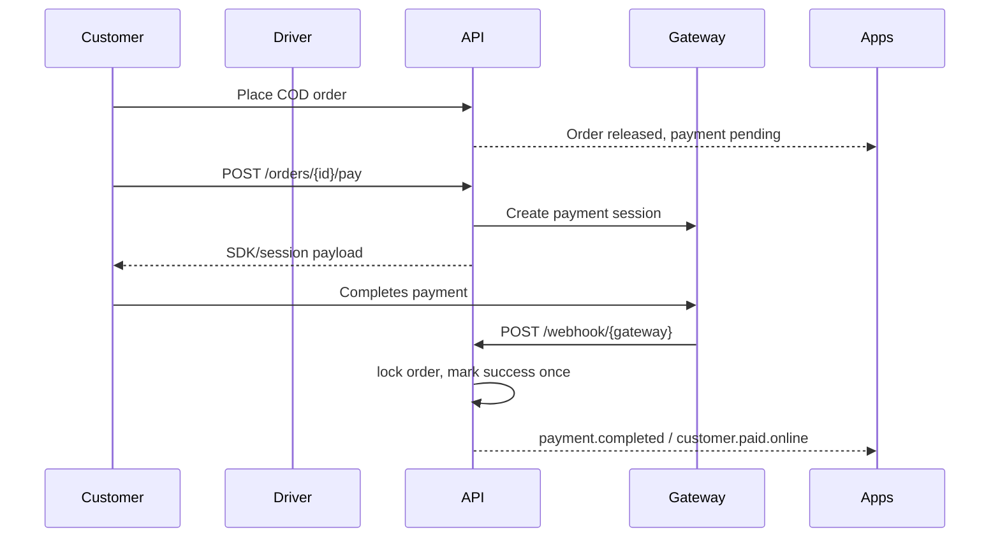
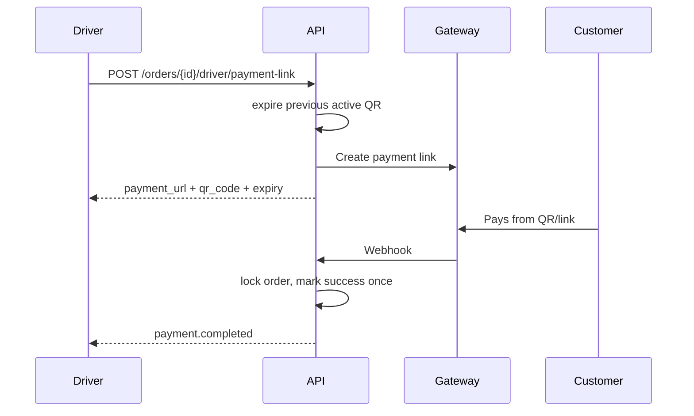
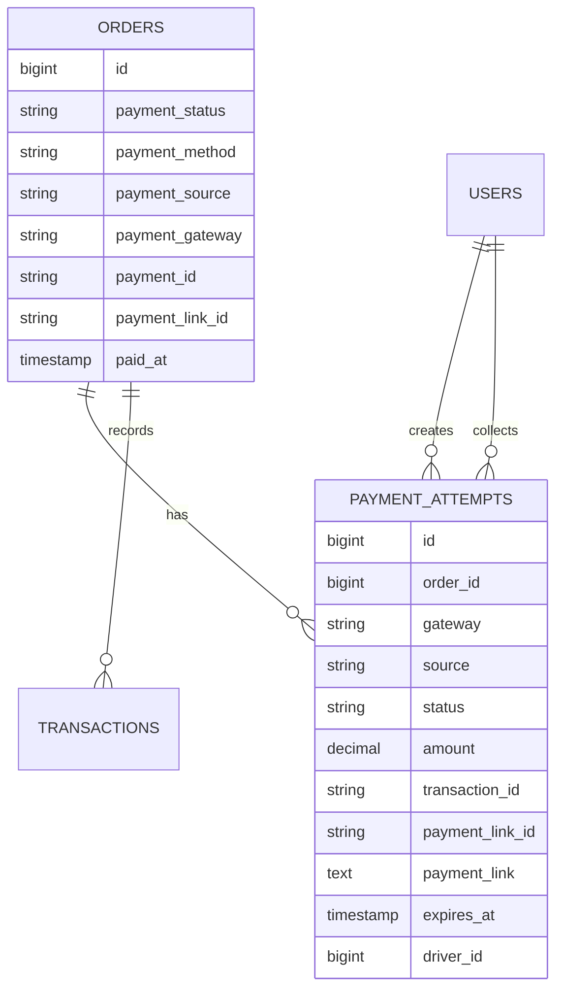

# Flexible COD Payment Collection

## API

All app APIs require Sanctum auth.

### `POST /api/orders/{id}/pay`

Creates a customer app payment attempt for a COD order.

Request:

```json
{ "gateway": "razorpay" }
```

Response:

```json
{
  "success": true,
  "data": {
    "payment_attempt_id": 1,
    "gateway": "razorpay",
    "source": "customer_app",
    "amount": 299.0,
    "currency": "INR",
    "payment_url": null,
    "qr_code": null,
    "expires_at": "2026-07-11T12:10:00+05:30",
    "order_id": "order_gateway_id",
    "key": "gateway_publishable_key"
  }
}
```

Already paid orders return HTTP `409`.

### `POST /api/orders/{id}/driver/payment-link`

Creates a fresh driver QR/payment-link attempt. Any previous active driver QR attempt for the order is marked `expired`.

Request:

```json
{ "gateway": "cashfree" }
```

Response includes `payment_url`, `qr_code`, `expires_at`, `amount`, and `currency`.

### `POST /api/orders/{id}/driver/cash`

Marks assigned-driver cash collection.

Request:

```json
{
  "amount": 299.0,
  "collection_notes": "Collected by driver at delivery"
}
```

### `GET /api/orders/{id}/payment-status`

Returns current order payment fields plus active and historical attempts.

### `POST /webhook/{gateway}`

Supported gateways: `razorpay`, `cashfree`, `stripe`.

Webhook signatures are verified by the gateway adapter. Only verified webhook events can mark an online attempt and order as successful.

## Sequence





## ER



## Invariants

- Internal paid status remains `success`.
- Online payment finalization is webhook-only.
- Only one active driver QR exists per order.
- Any successful payment cancels other open attempts.
- Duplicate paid attempts return HTTP `409` before creating a new session.
